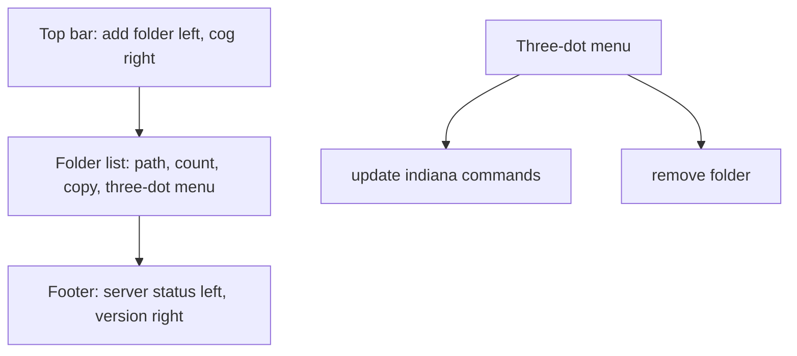

# Menulet Layout Refresh

## Assumptions
- Panel chrome: remove the inner bordered box and use a flat popover layout.
- Per-folder `update indianas-command`: run the existing `indiana templates refresh <folder>` behavior.
- Theme cog remains the theme control, just moved to the top toolbar.
- Menulet still shows and delegates; it does not scan, count, compile, or parse templates.

## Target Layout

## Implementation
- Update [`MENULET/src/index.html`](/Users/niklasingvar/workspace/indiana/MENULET/src/index.html):
  - Replace the bordered `#panel` stack with top toolbar, folder list area, and footer.
  - Move `#add-item` to top-left.
  - Move `#theme-cog` to top-right, outside the list area.
  - Move `#status` to bottom-left.
  - Add `#version` to bottom-right.
  - Add styling for a row-level three-dot button and small popover menu.

- Update [`MENULET/src/main.js`](/Users/niklasingvar/workspace/indiana/MENULET/src/main.js):
  - Import `getVersion` from `@tauri-apps/api/app` and render `v0.1.0` style text in `#version`.
  - Change folder rows from right-click remove to explicit three-dot menu.
  - Keep row/copy behavior intact: `copy` still calls `invoke("copy_folder", { path })` and writes returned text to clipboard.
  - Add menu actions:
    - `update indiana commands` → `invoke("refresh_templates", { path })`, then flash success.
    - `remove folder` → `invoke("remove_folder", { path })`, then `refreshFolders()`.
  - Close open menus on outside click and when a different folder menu opens.

- Add a thin Tauri command in [`MENULET/src-tauri/src/socket.rs`](/Users/niklasingvar/workspace/indiana/MENULET/src-tauri/src/socket.rs):
  - `refresh_templates(app, path) -> Result<bool, String>`.
  - Implement it by spawning the bundled `indiana` sidecar with `templates refresh <path>` via the shell plugin.
  - Return success/failure only; do not read or write template files in the menulet.

- Register the new command in [`MENULET/src-tauri/src/main.rs`](/Users/niklasingvar/workspace/indiana/MENULET/src-tauri/src/main.rs):
  - Add `socket::commands::refresh_templates` to `tauri::generate_handler!`.

- Update docs after code shape is known:
  - [`docs/menulet/MENULET_UI.md`](/Users/niklasingvar/workspace/indiana/docs/menulet/MENULET_UI.md): reflect top toolbar, row menus, bottom status/version.
  - [`docs/indiana/IN_FOLDER.md`](/Users/niklasingvar/workspace/indiana/docs/indiana/IN_FOLDER.md): note that menulet row update delegates to `indiana templates refresh <path>` and leaves existing files untouched.

## Verification
- Run frontend build in [`MENULET`](/Users/niklasingvar/workspace/indiana/MENULET): `npm run ui:build`.
- Run Rust checks for menulet backend: `cargo check --manifest-path MENULET/src-tauri/Cargo.toml`.
- Manual smoke in Tauri dev:
  - Cog appears top-right, add folder top-left.
  - Each folder row has a three-dot menu with update/remove.
  - Update creates missing `.indiana/<command>/prompt.md` files without overwriting existing files.
  - Remove drops the folder from monitoring and does not delete `.indiana/`.
  - Footer shows server status left and app version right.